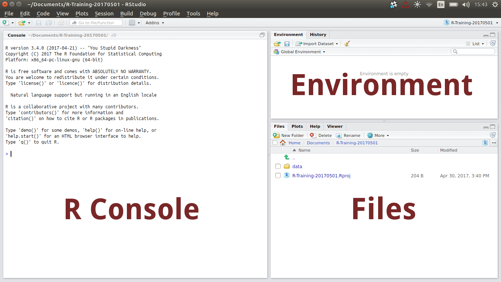

```{r setup, include=FALSE}
knitr::opts_chunk$set(echo = TRUE, include = TRUE, 
											eval = TRUE, results = "markup",
											message = FALSE, warning = FALSE)
```

# Session 1 | Introduction to RStudio

## What is RStudio?

* `R` and `RStudio` are two separate but connected things
    + `R` is like the engine of your car
    + `RStudio` is the 'cabin' we use to interact with the engine
    + `RStudio` even comes with extra flashy features not related to `R` 
* `R` does all the calculations, manages the data, generates plots
* `RStudio` helps manage our code, displays the plots plus more

## What is RStudio | Extra Flashy Features

* Some very helpful features of `RStudio`
    + We can write scripts and **execute code** interactively
    + Auto-completion by hitting the **\<tab\>** key
    + Use of `R Projects` to manage code/data for each project/analysis
    + We can see **everything** we need (directories, plots, code, history etc)
    + Integration with markdown, $\LaTeX$, bash, python, C++, version control software etc.

## Before we start

1. Create a folder on your computer for today's material
    + We recommend `Documents/R-Training-20170501` in your home folder
    + Create a sub-folder called `data`
2. Go to https://uofabioinformaticshub.github.io/Roseworthy-R-20170501/
    + Download the data file `toothData.csv` into  
    `Documents/R-Training-20170501/data`
3. Now we can open `RStudio`

## Before we start | Create an R Project

4. `File` > `New Project` > `Existing Directory` >
    + Browse to `Documents/R-Training-20170501`
    + `Create Project`

* `R Projects` are simply a wrapper for keeping an analysis organised
* The `R Project` name will **always** be the directory name
* Not essential, but are *good practice* and *extremely useful*

## The RStudio Interface

```{r, echo = FALSE, eval=TRUE, results='asis', out.width='800mm', fig.align='center'}

```

## The RStudio Interface | The R Console

* The `R Console` is the `engine`
* We can enter code directly here
* We can even use this as a simple calculator

```{r}
1 + 1
2*2
```

## The RStudio Interface | The R Console

As well as performing simple calculations:

* `R` has what we call an `Environment` (i.e. a Workspace)
* We can define objects here, or import data
   + Like a worksheet in Excel, but **much more** flexible & powerful
* `R` performs calculations & runs processes on these objects

## The R Environment | Creating an `R` object

To create an `R` object:

* We need to give it a name, and some data
* The process looks like `nameOfObject <- data`
    + The `<-` symbol is like an arrow
    + Tells `R` to put the `data` in the object
    
## The R Environment | Creating an `R` object

In the Console type:

```{r}
x <- 2
y <- 3
```

* We have created two objects, `x` and `y`
    + Look in your `Environment` Tab
    + This Tab tells us what objects are currently in the `Global Environment`

## The R Environment | Working with `R` objects

* We can now call these objects by name
* To see the value of an object, type it's name

```{r}
x
y
```


## The R Environment | Working with `R` objects

* We can also use them in calculations

```{r}
x + y
x / y
```

#### NB: R is *case sensitive*

## The R Environment | Functions

`R` has a series of inbuilt functions, e.g. `sqrt()`, `log()`, `max()`, `min()` etc

* We place an object or value inside the `()` after the name of a function

```{r}
sqrt(x)
log(x)
```

## The R Environment | Functions

* These functions are organised into a package called `base`
    + Always installed with `R`
    + Groups similar functions together
    
```{r, eval=FALSE}
?base
```

### Click on the underlined word `Index` at the bottom for a list of these

