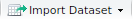
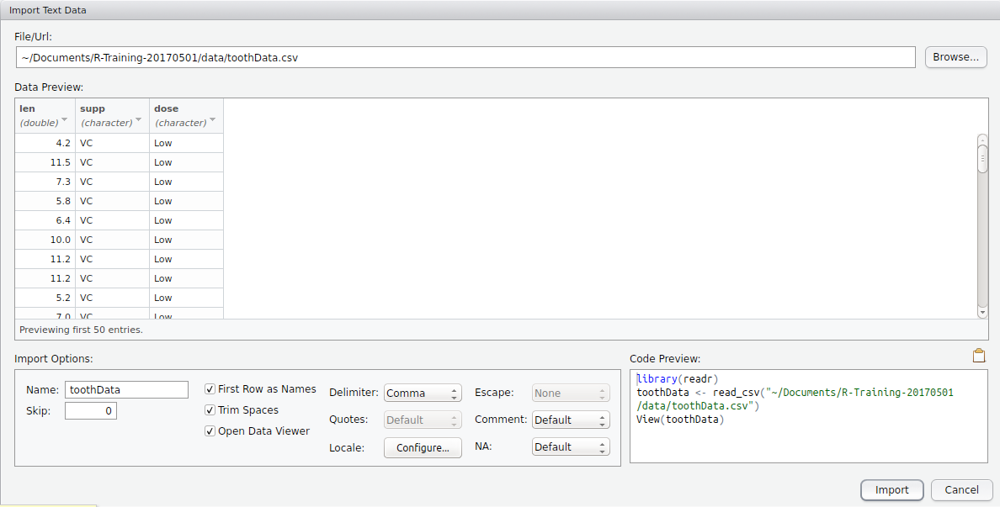
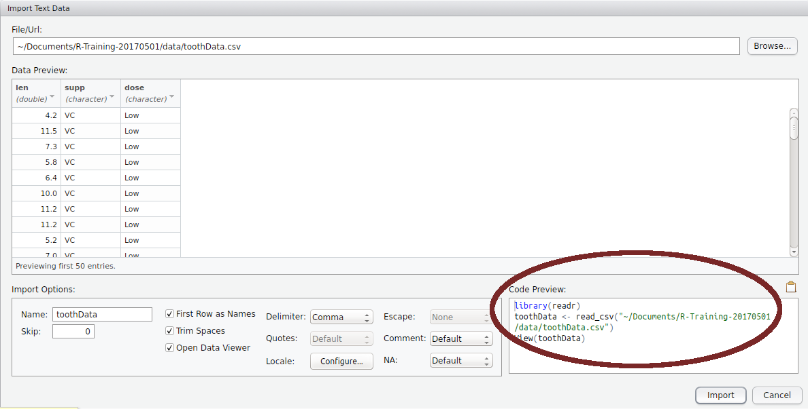
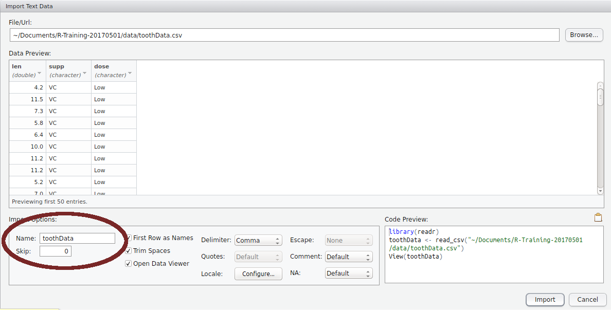

```{r setup, include=FALSE}
knitr::opts_chunk$set(echo = TRUE, include = TRUE, 
											eval = TRUE, results = "markup",
											message = FALSE, warning = FALSE)
```

```{r, echo=FALSE}
library(pander)
```


# Writing Scripts

## Writing Scripts

* So far we have entered everything directly in the `Console`  
$\implies$ This is a bad idea in the real world
    + We have no record of what we've done
    + How do we remember anything 6 months later?
    + How do we submit our methods to our patent lawyer?
    + How do you explain your analysis to a collaborator
* We usually record everything as a *script*
    + Not just **best practice** $\implies$ **essential practice**

## Writing Scripts

* `File` > `New File` > `R Script`
    + A new text file will now be in the top left quarter
    + Save this as `loadingData.R`
* Giving it the suffix `.R`:
    + Helps RStudio with auto completion
    + Helps us find our R scripts in a messy folder
* We enter text and `R` commands in this file
    + They are **not** executed until we send them to the `Console`
    
## Structure Of A Script

* No formal requirements (unlike `bash`)
* Usually have a mix of `R` commands, and comments
    + Comments explain what you're intending to 'future' you and others
    + Comments in an `R` script start with `#`
    + Anything following `#` are ignored by the `Console`
* I usually start mine by loading packages

## Loading Packages

* Similar functions are collected into `packages` (e.g. `base`)
    + `R` always loads `r pander(sessionInfo()$basePkgs)` at start-up
    + **NEVER** use the `Packages` Tab to load packages 
    + Remember, we **want a record** of literally everything we do
        + `Tools > Global Options > Packages >` **Uncheck** `Enable Packages Pane`
* Let's start by loading some packages
    + Lloyd will take you through the `dplyr` package later
    + Contains functions for working with the data we're about to load

## Loading Packages

```{r}
library(dplyr)
```

**NB: We have not yet sent this command to the `Console`**

1. Go to this line in the script
2. Linux/Windows: `Ctrl + Enter` or Mac `Command + Enter`
    + Ignore the friendly and helpful message
3. We have now loaded our first package...

<p style="color:blue">
**NB: If you don't have <code style="color:blue">dplyr</code> installed:**  
`Tools > Install Packages... >` then type `dplyr` and hit `Install`
</p>

# Loading Data

```{r, echo=FALSE}
library(readr)
toothData <- read_csv("~/Documents/R-Training-20170501/data/toothData.csv")
```


## Loading Data

`RStudio` has a handy GUI for loading data into your `R Environment`

1. Go the the `Environment Tab`
2. `Import Dataset` ()
3. `From CSV...`
4. `Browse` to `data/toothData.csv`

**Stop there!!!**

## Loading Data

```{r, echo=FALSE, out.width='950mm', fig.align='center'}

```

## Loading Data

```{r, echo=FALSE, out.width='950mm', fig.align='center'}
knitr::include_graphics("../images/importGUI_preview.png")
```

## Loading Data

```{r, echo=FALSE, out.width='950mm', fig.align='center'}

```

## Loading Data

1. Select all the code in the `Code Preview` Box
2. Paste this into your script, below `library(dplyr)`
3. Click `Import`
4. Magic happens...

## Loading Data

The code we copied has 3 lines:

1. `library(readr)`
    + This package contains the function `read_csv()`
2. `toothData <- read_csv("~/Documents/R-Training-20170501/data/toothData.csv")`
    + This is the code executed to load the data into your `R Environment`
    + It created an object named `toothData` by using the file name.
    
## Loading Data

```{r, echo=FALSE, out.width='950mm', fig.align='center'}

```

## Loading Data

1. `library(readr)`
    + This package contains the function `read_csv()`
2. `toothData <- read_csv("~/Documents/R-Training-20170501/data/toothData.csv")`
    + This is the code executed to load the data into your `R Environment`
    + It created an object named `toothData` by using the file name.
3. `View(toothData)` Open a preview in a familiar `Excel-like` format
    + I **never** use this
    + Close the preview by clicking the cross and delete `View(toothData)`
    
# Data Frames

## Data Frames

```{r}
toothData
```

## Data Frames | What is a tibble?

* A `tibble` is a type of `R` object called a `data.frame`
    + Used to be known as a `tbl_df` based on an SQL table
    + Became shortened to `tibble`
* Is a normal `data.frame` with a couple of nicer feature
    + Only prints what fits on your screen
    + A regular `data.frame` dumps **everything**
    
## Data Frames | What is a `data.frame`?

* These are very much like an Excel spreadsheet
    + Here we have `r nrow(toothData)` rows and `r ncol(toothData)` columns
* Each column is a `vector`

### Q: What does this last statement mean?
    
## Data Frames | What is a `data.frame`?

* These are very much like an Excel spreadsheet
    + Here we have `r nrow(toothData)` rows and `r ncol(toothData)` columns
* Each column is a `vector`

### Q: What does this last statement mean?

A : Now we have to care about what columns contain numbers, words etc.!
    
## Data Frames | Columns as vectors

* We can just grab a single column by placing a `$` after the name

```{r, eval=FALSE}
toothData$len
toothData$supp
toothData$dose
```

* Lloyd will take us through subsetting in more detail

## Data Frames

* Here `supp` and `dose` represent the *supplement method* and *dosage* of vitamin C given to guinea pigs
    + `len` represents the length of their incisors
* Would `supp` and `dose` be categorical variables?
    + Yes, let's convert them
    + Enter these lines in your script, then send to the `Console`
    
```{r}
# Convert the supplement method and dosage to factors
toothData$supp <- as.factor(toothData$supp)
toothData$dose <- as.factor(toothData$dose)
```

## Data Frames

```{r, results='hide'}
toothData
```

* Note that the columns are now specified as `<fctr>`
* The old import method used a function `read.csv()`
    + Automatically converted `characters` to `factors`
    + Nearly **everyone** has made mistakes as a result
    + Best practice: If you want a factor $\implies$ manually specify this!
    
## Data Frames

### Q: What if we changed our mind and didn't want them to be converted to factors?

## Data Frames

### Q: What if we changed our mind and didn't want them to be converted to factors?

A: Delete those lines from the script, and run it from the top again.

* **Always** copy those lines from the import GUI
* See how useful a script might be...

## Data Frames

A `data.frame` is a special case of an `R` object called a `list`

* Beyond the scope of today

# Matrices

## Matrices

* In a `data.frame`, each column was a `vector`
    + Each column could be a different type of value
* A `matrix` is like a 2D vector
    + We have rows and columns
    + The entire matrix must be the same type of value
    + Can be very useful for statisticians and mathematicians
* **Importantly**, we cannot select a column of a `matrix` using the `$` symbol

## Matrices

### Q: What would happen if we converted `toothData` into a matrix?

```{r, eval=FALSE}
as.matrix(toothData)
```

## Matrices

### Q: What would happen if we converted `toothData` into a matrix?

A: The `numeric` values would become `character` values

## Summary

* Vectors (1D) and Matrices (2D) are all the same type of values
* Data Frames (2D) have columns as vectors
* Always keep a script
    + Start a script with loading your packages
    + Write comments to communicate your intentions, and explain details
* Package installation uses `install.packages("packageName")`
